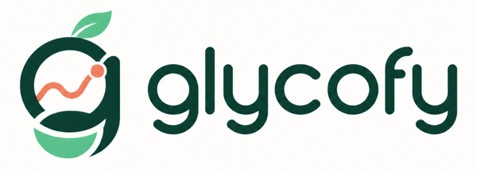

<div align="center">
  
  <h1>Athlete-aware AI meal planning</h1>
  <p>Glycofy turns an athlete’s profile, nutrition targets, and training schedule into practical daily and weekly meal plans—then carries those plans through cooking and grocery preparation.</p>
  <p><a href="https://app.glycofy.ai">Live application</a> · <a href="SECURITY.md">Security policy</a> · <a href="docs/RENDER_DEPLOYMENT.md">Deployment guide</a></p>
</div>

> [!IMPORTANT]
> Glycofy is under active development. It provides planning assistance, not medical advice, diagnosis, or treatment.

## Why Glycofy exists

Most meal planners treat every day alike. Athletes do not train that way.

Glycofy is being built around a different premise: nutrition planning should understand the work an athlete has completed, the sessions coming next, their body and performance goals, and the foods they can safely and realistically eat.

The result is a connected workflow:

```text
Athlete profile + training context
                ↓
      Energy and macro targets
                ↓
        AI-generated meal plan
                ↓
     Cooking guidance and swaps
                ↓
 Normalized, reviewable grocery list
```

## Current capabilities

- **Complete athlete onboarding** — units, body measurements, sex, date of birth, goals, timezone, dietary pattern, allergies, and ingredient exclusions.
- **Training-aware nutrition** — completed Strava activities and upcoming workouts inform recovery and fueling decisions.
- **AI quality and safety harness** — generated meals are checked for diet/allergen conflicts, nutrition plausibility, complete measured ingredients, cooking safety, and realistic timing before they can be persisted.
- **Flexible training input** — users can connect Strava, enter workouts manually, or import planned workouts from a TrainingPeaks CSV export.
- **Daily and weekly AI planning** — structured meal recommendations target calories and macronutrients while enforcing dietary safety and weekly variety.
- **Transparent planning context** — Glycofy explains when recent or upcoming training data is missing and falls back to standard athlete targets.
- **Practical recipes** — meal ingredients, estimated cooking time, coordinated directions, and protein doneness guidance.
- **Meal control** — individual AI swaps, full-day planning, explanations, locking, and grocery exports.
- **Adaptive meal feedback** — athletes can record meal completion, substitutions, portions, ratings, hunger, energy, digestion, and preparation practicality; bounded preference signals improve future AI plans.
- **Package-aware grocery preparation** — ingredients are consolidated across the week, compatible measurements are converted, household servings can be scaled, likely package counts and leftovers are shown, brand/package/pantry preferences persist, and reviewed lists can be approved as stable shopping snapshots.
- **Secure authentication** — email/password, Google OIDC, and WebAuthn passkeys; revocable stateful HTTP-only sessions; OAuth state/nonce validation; encrypted provider credentials; layered rate limiting; and security audit events.

## Product direction

The next major product layers are:

1. Grocery-delivery cart integrations after a weekly list is approved.
2. Direct TrainingPeaks integration if API access becomes available.
3. Shared job infrastructure for scalable, cancellable weekly AI generation.

The long-term goal is a closed loop in which training informs nutrition, the plan becomes easy to shop and cook, and real-world athlete feedback improves the next plan.

## Architecture

| Layer | Technology | Responsibility |
| --- | --- | --- |
| Web application | HTML, CSS, vanilla JavaScript | Responsive planning, training, profile, and grocery experiences |
| API | Python 3.11, FastAPI, Pydantic | Authentication, planning, integrations, validation, and application workflows |
| Persistence | SQLAlchemy, Alembic, PostgreSQL | User, training, nutrition, meal-plan, and approval data |
| AI planning | OpenAI structured generation | Dietary-safe recipes, weekly variety, cooking guidance, and macro-aware recommendations |
| Integrations | Google OAuth, Strava OAuth/webhooks, TrainingPeaks CSV | Identity and training context |
| Production | Docker, Render, GitHub Actions | Deployment, migrations, health checks, and verification gates |

The production entry point is `app.main:app`.

## Local development

### Prerequisites

- Python 3.11
- PostgreSQL for production-parity testing, or SQLite for a quick local start
- Node.js 22 for the JavaScript dependency audit

### Setup

```bash
git clone https://github.com/marcnester/glycofy-api.git
cd glycofy-api

python3.11 -m venv .venv
source .venv/bin/activate
pip install -r requirements.txt -r requirements-dev.txt

cp .env.example .env
alembic upgrade head
uvicorn app.main:app --reload --host 127.0.0.1 --port 8090
```

Open [http://localhost:8090](http://localhost:8090). Using `localhost` keeps local WebAuthn/passkey origin validation aligned with `.env.example`.

The default development configuration uses SQLite. Configure `DATABASE_URL` with a PostgreSQL connection string when testing production behavior.

## Configuration

Configuration is read from environment variables or a local `.env` file. Start with [.env.example](.env.example).

| Variable | Purpose |
| --- | --- |
| `DATABASE_URL` | SQLAlchemy database connection string |
| `JWT_SECRET` | Session-signing secret; use at least 32 random characters |
| `OAUTH_TOKEN_ENCRYPTION_KEY` | Fernet key used to encrypt retained provider credentials |
| `EDGE_ORIGIN_SECRET` | Shared secret injected by Cloudflare and validated by the Render origin |
| `WEBAUTHN_RP_ID` / `WEBAUTHN_EXPECTED_ORIGIN` | Exact passkey relying-party domain and HTTPS origin |
| `OPENAI_API_KEY` | Enables AI meal recommendations |
| `USDA_FDC_API_KEY` | Verifies generated ingredient nutrition against FoodData Central |
| `USDA_FDC_WEEKLY_SYNC_LOOKUPS` | Caps live USDA lookups during a weekly request; remaining foods reconcile in the background |
| `GOOGLE_CLIENT_ID` / `GOOGLE_CLIENT_SECRET` | Google account authentication |
| `STRAVA_CLIENT_ID` / `STRAVA_CLIENT_SECRET` | Strava activity integration |
| `PUBLIC_BASE_URL` | Canonical public application URL |
| `ALLOWED_ORIGINS` / `ALLOWED_HOSTS` | Browser and host allowlists |

Never commit `.env`, databases, OAuth credentials, API keys, exported user data, or production logs. Production secrets belong in the hosting provider’s secret store.

## Database migrations

Apply the complete schema chain with:

```bash
alembic upgrade head
```

Render runs the same command as a pre-deploy step. New migrations should be safe on PostgreSQL and tested from an empty database through the current head.

## Verification

```bash
pytest -q
ruff check app tests
mypy app
bandit -q -lll -r app -x tests
pip-audit -r requirements.txt
npm test
```

GitHub Actions repeats the test, dependency, static-analysis, and full-history Gitleaks checks for pushes and pull requests.

## Security and privacy

Glycofy handles health-adjacent, dietary, allergy, and connected-account information. The application therefore uses a fail-closed production configuration, HTTP-only secure cookies, revocable stateful sessions, optional phishing-resistant passkeys, CSRF/origin controls, an authenticated Cloudflare-to-origin boundary, bounded request bodies, authentication and OAuth rate limits, encrypted OAuth tokens, redacted structured logging, and privacy-safe audit events. The evidence-backed OWASP ASVS 5.0 L1/L2 review and its explicit exceptions are published under [`docs/`](docs/OWASP_ASVS_L2_GAP_ASSESSMENT_2026-09-16.md).

Athletes can verify their email, recover a password with expiring single-use links, export their account data, disconnect Strava, and permanently delete their account from Profile. Transactional account email requires the SMTP settings documented in [`.env.example`](.env.example).

Please do not open public issues containing vulnerabilities, credentials, personal information, activity exports, screenshots of private health data, or production logs. Follow [SECURITY.md](SECURITY.md) for the current security baseline and reporting guidance.

## Repository status and license

This repository is publicly visible to document Glycofy’s development and architecture. It is proprietary and is not open-source software. Public visibility does not imply permission to use, copy, modify, deploy, or redistribute the code. See [LICENSE](LICENSE) for the complete terms and [CONTRIBUTING.md](CONTRIBUTING.md) before submitting an issue or pull request.
